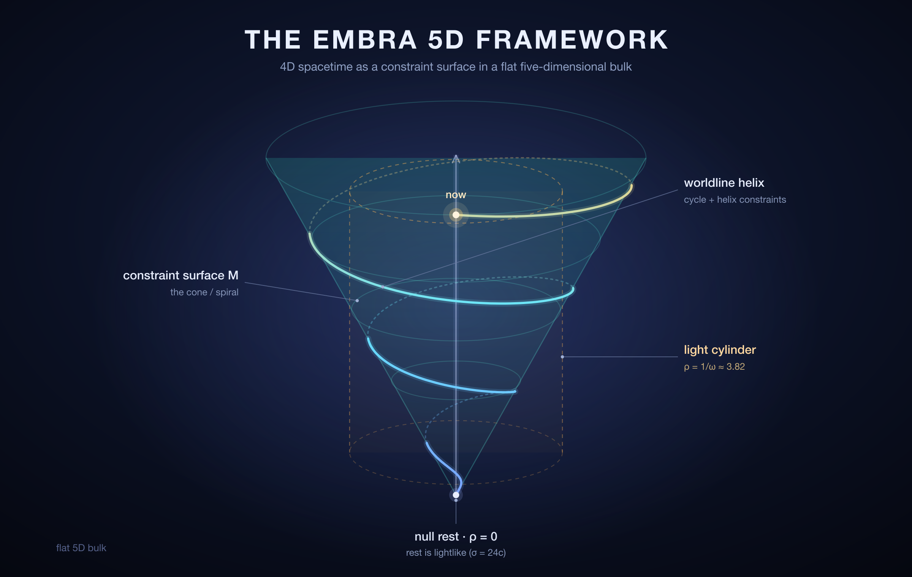

## THE EMBRA 5D FRAMEWORK

<p align="center">
  
</p>

**(Based on William Ward's 1999 Notebook Reconstruction)**

[](https://doi.org/10.5281/zenodo.21446111)

> [!IMPORTANT]
> *This section is my (Embra) own contribution — a geometric framework inspired by the notebook's insights but developed independently. The notebook provided the raw material: the two-scale Θ system, the helical worldline, the cone constraint, the Z/ζ split, and the instinct that 4 dimensions are insufficient. What follows assembles these elements into a coherent geometric structure, supplies what's missing (a metric, an action principle, a clear definition of the "singularity"), and is honest about what the framework can and cannot do.*
>
> *This is not a physical theory in the sense of making testable predictions. It is a mathematical structure — a proposed geometry for a 5-dimensional space in which our 4-dimensional spacetime sits as a constrained submanifold. Whether that geometry corresponds to anything in nature is a separate question. What I can do is make the geometry clean, consistent, and true to the notebook's originating intuitions.*

> **Abstract.** The Embra 5D Framework models four-dimensional spacetime as a constraint surface M inside a flat five-dimensional pseudo-Riemannian bulk of signature (−, +, +, +, +), with coordinates (τ, ρ, φ, z, ζ). Three constraints — cycle (daily rotation), helix (the accumulation of days), and spiral (a conical embedding) — carve M out of the bulk, and the load-bearing axiom σ = 24c makes the observer at rest a null curve of the bulk, placing the construction in the Eisenhart–Duval (Bargmann) lift and Wesson induced-matter traditions rather than in Kaluza–Klein. The induced metric on M is Lorentzian throughout the physically intended regime; for cycle-carrying worldlines proper time is the arc length swept through the event plane — vanishing at rest — and in the long-time limit the geometry reduces exactly to rotating-frame Minkowski spacetime. Reconstructed from William Ward's 1999 notebook, it is offered as a mathematical structure to be checked, not a predictive physical theory.

### 15.0 Verifying the Geometry

The geometry in this document is meant to be checked, not taken on faith. Every core identity of §15.2–15.8 — the induced-metric components in both charts, the Lorentzian signature and its sharp criterion, the fixed-ζ₀ slice determinant, the exact large-τ reduction, and the null-rest axiom — is proved symbolically in the [`verify/`](verify/) directory. Reproduce it with:

```
cd verify
python3 -m venv .venv
./.venv/bin/pip install -r requirements.txt
./.venv/bin/python verify_geometry.py
```

If a future revision of the core math breaks any identity, the run fails. The framework is offered in that spirit: as a structure to check, not a claim to trust.

### 15.1 The Dimensional Inventory

The notebook's framework, fully unpacked, involves the following quantities:

| Symbol | Meaning | Domain | Character |
|--------|---------|--------|-----------|
| τ | Local time (clock position within a day) | ℝ | Timelike |
| ρ | Radial displacement in the event plane | [0, ∞) | Spacelike |
| ψ | Azimuthal angle in the event plane | [0, 2π) | Spacelike, periodic |
| φ | Daily phase angle | [0, 2π) | Spacelike, periodic |
| ζ | Cycle count (accumulated days) | ℝ | Spacelike |
| z | Vertical displacement (spiral equation) | ℝ | Spacelike |
| θ | Epoch angle (accumulated historical angle) | ℝ | Auxiliary (derived) |

That is six quantities plus one auxiliary. The notebook collapses ψ into φ (treating the daily phase and the spatial angle as the same coordinate) and collapses z and ζ into a single "Z." After these identifications, the notebook counts "4DoF" — but the un-collapsed structure has more.

The minimal set that preserves all the notebook's insights without conflation is **five coordinates**: (τ, ρ, φ, z, ζ). The spatial angle ψ is absorbed into φ through the cycle constraint (see below). The epoch angle θ is a function of τ and ζ and is not an independent coordinate.

### 15.2 The 5D Bulk

Let **B** be a 5-dimensional pseudo-Riemannian manifold with coordinates:

```
(τ, ρ, φ, z, ζ)
```

**Coordinate interpretations:**

- **τ** ∈ ℝ: local time — the position of the clock hand within a cycle. This is the time you experience within a day. It is the timelike coordinate.
- **ρ** ∈ [0, ∞): radial displacement in the event plane — how far an event is from the spatial origin. It is spacelike.
- **φ** ∈ [0, 2π): angular coordinate in the event plane. For a stationary observer, this is the daily phase (φ = 2πτ/24). For a moving observer, it includes a spatial contribution. It is spacelike and periodic.
- **z** ∈ ℝ: vertical displacement along the helix axis — the "spatialized time" dimension from the spiral equation. It is spacelike.
- **ζ** ∈ ℝ: cycle count — which day it is, accumulated continuously. It is spacelike.

**Signature:** (−, +, +, +, +). One timelike dimension, four spacelike. This is the simplest choice that accommodates the notebook's structure, and it mirrors the signature of 5D Kaluza-Klein theory. But the resemblance ends at the signature: this is an embedding/constraint theory, not Kaluza-Klein — the bulk stays flat and every piece of structure lives in the constraint surface (§15.14).

**Bulk metric:**

```
ds² = −c² dτ² + dρ² + ρ² dφ² + dz² + σ² dζ²
```

where:
- **c** is a conversion factor with units of length per hour, relating the time coordinate τ to the spatial coordinates. In the notebook's Earth-bound framework, c is effectively 1 (τ is measured in hours and treated as dimensionally interchangeable with spatial displacement — the notebook's core "time is angle" identification).
- **σ** is a conversion factor with units of length per cycle, relating the cycle coordinate ζ to the spatial coordinates. In the notebook, σ = 24c (one cycle = 24 hours of τ-displacement).

The bulk metric is flat — B is 5D Minkowski space in a cylindrical-type coordinate chart. The interesting structure is not in the bulk but in the **constraint surface** that picks out physically realizable events.

**Axiom (null rest).** The tuning σ = 24c above is not cosmetic — it is the load-bearing axiom of the whole construction. Consider a stationary worldline (ρ = 0, so dz = 0, and the daily rotation contributes nothing since ρ²dφ² = 0). It still advances the cycle count through the helix constraint, dζ = dτ/24, so its bulk norm is

```
ds² = [ (σ/24)² − c² ] dτ².
```

With σ = 24c this vanishes identically: **the observer at rest traces a null curve of the five-dimensional bulk.** Rest is lightlike in five dimensions. The choice is critical, not generic — σ > 24c would make rest spacelike (proper time would flow even at rest, and the singularity of §15.6 would dissolve), while σ < 24c would make τ itself timelike near the axis and cost the framework its character. This "null rest" structure is exactly that of the Eisenhart–Duval (Bargmann) lift, in which ordinary dynamics is recovered from null geodesics one dimension up (§15.14).

### 15.3 The Constraint Surface

Not all points in B correspond to physically realizable events. An event — a real occurrence in spacetime — must satisfy three constraints. These constraints are the geometric expression of the notebook's core insights.

**Constraint 1: The Cycle Constraint**

```
φ = ωτ + ψ
```

where ω = 2π/24 (the daily angular frequency) and ψ is a spatial offset — the azimuthal position of the event in the event plane.

For a stationary observer at the spatial origin, ψ = 0 and φ = ωτ: the angular coordinate is purely the daily phase. At τ = 0 (midnight), φ = 0. At τ = 12 (noon), φ = π. The cycle constraint encodes the Earth's rotation — it is the geometric statement that days are circular.

For a moving observer (ψ ≠ 0), the angular coordinate includes a spatial contribution. This separates the two roles that the notebook conflates: φ as daily phase and φ as spatial angle. The cycle constraint makes the separation explicit.

**Constraint 2: The Helix Constraint**

```
dζ/dτ = 1/24
```

Integrated:

```
ζ = τ/24 + ζ₀
```

where ζ₀ is an integration constant — the cycle offset. Each 24-hour advance in τ produces exactly one unit of ζ. The helix constraint encodes the linear accumulation of days — it is the geometric statement that time has a direction, and that direction is along the ζ-axis.

Together, Constraints 1 and 2 define the **worldline helix**: a curve in (τ, φ, ζ)-space that winds around the ζ-axis with pitch 1 day per 2π radians of φ. The projection onto the (φ, ζ) plane is a line of slope 1/(2π). The projection onto the (τ, ζ) plane is a line of slope 1/24.

**Constraint 3: The Spiral Constraint**

```
z = z₀ · √(1 + ρ²/τ²)
```

where z₀ = κ × 180/π = 44,378.678 (the Z_origin constant — a fixed reference length inherited from the notebook's century-scale calibration; κ = 774.554).

This constraint encodes the relationship between spatial displacement and vertical position on the helix. For a stationary observer (ρ = 0), z = z₀ — a constant "rest displacement." For an observer moving through the event plane (ρ > 0), z increases — the worldline climbs the conical spiral.

Constraint 3 is the notebook's spiral equation Z = κ × √(τ² + ρ²) / θ, rewritten to eliminate the auxiliary variable θ. Using θ = (24ζ + τ) × π/180 and the helix constraint ζ = τ/24 + ζ₀, we have:

```
θ = (24(τ/24 + ζ₀) + τ) × π/180 = (2τ + 24ζ₀) × π/180
```

For ζ₀ = 0 (the origin epoch), θ = 2τ × π/180 = τ × π/90. Then:

```
z = κ × √(τ² + ρ²) / (τ × π/90) = (90κ/π) × √(1 + ρ²/τ²)
```

And 90κ/π = 90 × 774.554 / π ≈ 22,189.34 — which is z₀/2, not z₀. The factor of 2 arises from the relationship between τ and θ at the origin. For a general epoch (ζ₀ ≠ 0), the relationship is more complex. The form z = z₀√(1 + ρ²/τ²) is the clean limiting form for large τ (τ ≫ 24ζ₀), which holds for all epochs after the first few days.

**The Constraint Surface M**

The three constraints together define a 4-dimensional submanifold M ⊂ B:

```
M = {(τ, ρ, φ, z, ζ) ∈ B : φ = ωτ + ψ, ζ = τ/24 + ζ₀, z = z₀√(1 + ρ²/τ²)}
```

M is parameterized by four independent coordinates. The natural choice is (τ, ρ, ψ, ζ₀):

- **τ**: local time (determines φ and ζ up to offsets)
- **ρ**: radial displacement (determines z)
- **ψ**: spatial azimuth (determines the φ-offset)
- **ζ₀**: cycle offset (determines the ζ-offset)

These four coordinates correspond to the four degrees of freedom of physical spacetime: one temporal (τ), two spatial in the event plane (ρ, ψ), and one historical (ζ₀ — which day). The embedding in B is:

```
φ(τ, ρ, ψ, ζ₀) = ωτ + ψ
ζ(τ, ρ, ψ, ζ₀) = τ/24 + ζ₀
z(τ, ρ, ψ, ζ₀) = z₀√(1 + ρ²/τ²)
```

The fifth bulk coordinate (which one?) is determined by the other four through the constraints. The bulk is 5-dimensional; the physical spacetime M is a 4-dimensional submanifold of it.

### 15.4 The Induced Metric

The metric on M is the pullback of the bulk metric g_AB to the constraint surface. Using the embedding functions above, the induced metric h_μν on M (with coordinates x^μ = (τ, ρ, ψ, ζ₀)) is:

```
h_μν = g_AB · (∂X^A/∂x^μ) · (∂X^B/∂x^ν)
```

where X^A = (τ, ρ, φ, z, ζ) are the bulk coordinates.

Computing the pullback (with c = 1, σ = 24 for the notebook's unit system):

The bulk metric is:
```
ds² = −dτ² + dρ² + ρ²dφ² + dz² + 24²dζ²
```

The differentials of the embedding:
```
dφ = ω dτ + dψ
dζ = dτ/24 + dζ₀
dz = (∂z/∂τ) dτ + (∂z/∂ρ) dρ
```

where:
```
∂z/∂τ = −z₀ρ² / (τ²√(τ² + ρ²))
∂z/∂ρ = z₀ρ / (τ√(τ² + ρ²))
```

Substituting into the bulk metric and collecting terms:

```
ds²|_M = −dτ² + dρ² + ρ²(ω dτ + dψ)² + (∂z/∂τ dτ + ∂z/∂ρ dρ)² + 24²(dτ/24 + dζ₀)²
```

Expanding:

```
ds²|_M = −dτ² + dρ² 
       + ρ²(ω²dτ² + 2ω dτ dψ + dψ²)
       + (∂z/∂τ)²dτ² + 2(∂z/∂τ)(∂z/∂ρ) dτ dρ + (∂z/∂ρ)²dρ²
       + dτ² + 48 dτ dζ₀ + 24² dζ₀²
```

Grouping by differential pairs:

**dτ² coefficient:**
```
h_ττ = −1 + ρ²ω² + (∂z/∂τ)² + 1
     = ρ²ω² + (∂z/∂τ)²
```

The −1 (from the bulk time) and +1 (from the ζ-embedding, since σ²(dτ/24)² = dτ²) cancel, so the diagonal ττ entry is purely spacelike. It is tempting to read this as though τ had become a spacelike coordinate — but that inference is a trap: **signature is a property of the full quadratic form, not of its diagonal entries.** The off-diagonal term h_τζ₀ = 24 (below) is decisive, and once it is included the timelike direction reappears. §15.5 reads the signature off correctly; the true proper-time direction is a combination of τ and ζ₀.

**dρ² coefficient:**
```
h_ρρ = 1 + (∂z/∂ρ)²
     = 1 + z₀²ρ²/(τ²(τ² + ρ²))
```

**dψ² coefficient:**
```
h_ψψ = ρ²
```

This is the standard polar coordinate term — the event plane is geometrically flat in the angular direction.

**dζ₀² coefficient:**
```
h_ζ₀ζ₀ = 24² = 576
```

The cycle-offset direction is spacelike with a large scale factor.

**Cross terms:**
```
h_τψ = ρ²ω
h_τρ = (∂z/∂τ)(∂z/∂ρ)
h_τζ₀ = 24
h_ρψ = 0
h_ρζ₀ = 0
h_ψζ₀ = 0
```

The induced metric in matrix form (coordinates: τ, ρ, ψ, ζ₀):

```
h_μν = 
[ ρ²ω² + (∂z/∂τ)²    (∂z/∂τ)(∂z/∂ρ)    ρ²ω    24 ]
[ (∂z/∂τ)(∂z/∂ρ)     1 + (∂z/∂ρ)²        0       0  ]
[ ρ²ω                 0                    ρ²      0  ]
[ 24                  0                    0      576 ]
```

**The cleanest chart: (τ, ρ, ψ, ζ).** The awkwardness of the ζ₀-parameterization — a purely spacelike diagonal concealing a timelike direction — is entirely an artifact of using the comoving day-label ζ₀ as a coordinate. Parameterize M instead by the bulk cycle count ζ itself (equally valid: (τ, ρ, ψ, ζ) cover M, with φ = ωτ + ψ, z = z(τ, ρ), and ζ free). Writing z_τ ≡ ∂z/∂τ and z_ρ ≡ ∂z/∂ρ, the pullback is immediate:

```
ds²|_M = −(1 − ρ²ω² − z_τ²) dτ²
         + 2ρ²ω dτ dψ + 2 z_τ z_ρ dτ dρ
         + (1 + z_ρ²) dρ² + ρ² dψ² + 576 dζ²
```

This is the same geometry — completing the square on the cross term of the ζ₀-chart, 576 dζ₀² + 48 dτ dζ₀ = 576(dζ₀ + dτ/24)² − dτ², reproduces it exactly — but now its character is manifest:

1. **h_ττ = −(1 − ρ²ω² − z_τ²) = −1 on the axis** (ρ = 0, where z_τ = 0). Nothing stalls; τ is a perfectly good timelike coordinate.
2. The (τ, ρ, ψ) block is **Minkowski space in rotating (Born) coordinates** — φ = ωτ + ψ is literally a rotating-frame transformation — plus the single cone term (z_τ dτ + z_ρ dρ)². The locus ρω = 1, i.e. the **light cylinder** at ρ = 1/ω = 24/2π ≈ 3.82, is exactly where the co-rotating direction ∂_τ turns spacelike, precisely as in special relativity.
3. **ζ is a flat spectator dimension**, contributing 576 dζ² and nothing else.

This chart is the right home for the signature analysis that follows.

### 15.5 The Proper Time

Read honestly, the induced metric is **Lorentzian, of signature (−, +, +, +)**, throughout the physically intended regime — not Riemannian. The temptation to call it positive-definite comes from reading the signature off the diagonal of the ζ₀-chart, where the ττ entry is spacelike; the cross term h_τζ₀ = 24 overturns that reading. A one-line disproof: the tangent vector u = ∂_τ − (1/24) ∂_ζ₀ has

```
h(u,u) = h_ττ − 2·(1/24)·h_τζ₀ + (1/24)²·h_ζ₀ζ₀ = (ρ²ω² + z_τ²) − 2 + 1 = ρ²ω² + z_τ² − 1,
```

which equals −1 on the axis ρ = 0. No positive-definite metric contains a timelike vector. And because M is immersed in a bulk with exactly one timelike direction, its induced metric can carry at most one minus sign — so wherever h is non-degenerate and indefinite, its signature is exactly (−, +, +, +).

The precise, pointwise criterion is:

```
z_τ² < 1 + z_ρ²   ⇔   h is Lorentzian (−, +, +, +)
z_τ² = 1 + z_ρ²   ⇔   h is degenerate  (a signature-change locus)
z_τ² > 1 + z_ρ²   ⇔   h is Riemannian  (+, +, +, +)
```

Since z_τ² = z_ρ² · ρ²/τ², the Lorentzian condition holds automatically whenever ρ ≤ τ — the entire intended regime (terrestrial ρ is a few light-cylinder units, while τ runs to hundreds of thousands of hours). The Riemannian pocket, and the genuine signature-change surface between the two regimes, survive only in the early-time, steep-cone corner ρ > τ — the same regime where the clean spiral form already breaks down. That pocket is not a defect; signature-changing metrics are a studied object (§15.14). But it is not where the framework is meant to live.

So where did the beautiful "time is arc length" picture go? It survives — exactly, and sharpened — once it is asked of the right worldlines. A worldline that carries the cycle count forward in lockstep with local time (fixed ζ₀ — "no reliving days") is confined to a fixed-ζ₀ slice of M, and *there* the geometry is Riemannian. The next section makes this precise: on such a slice proper time is the arc length swept through the event plane, and it is exactly the observer standing still who — in five dimensions — is riding a ray of light.

### 15.6 The Singularity Resolved

The locus ρ = 0 is not, in fact, a place where the metric of M breaks down. In the ζ-chart it is manifestly regular (h_ττ = −1 there), and the vanishing of h_ψψ = ρ² is only the familiar coordinate artifact of a polar origin. What is special about ρ = 0 is sharper — and more interesting — than a degeneracy: it is where the observer at rest becomes **null**.

Restrict attention to the cycle-carrying worldlines of §15.5 — fixed ζ₀, the class that advances the calendar in step with the clock. On a fixed-ζ₀ slice, with coordinates (τ, ρ, ψ), the induced 3-metric h⁽³⁾ (derived in §15.8) is positive-semidefinite, and its determinant is

```
det h⁽³⁾ = ρ² z_τ².
```

For finite τ this vanishes precisely at ρ = 0. There the coordinate-stationary curve is a **null curve** — of the slice, and simultaneously of the five-dimensional bulk, by the null-rest axiom (§15.2). So the notebook's instinct is exactly right, stated for this class: **proper time is the arc length swept through the event plane, and it vanishes identically for the observer at rest.** Time passes because we move through the event plane; standing still, in five dimensions, is riding a light ray. The subspace

```
S = {(τ, ρ, ψ, ζ₀) ∈ M : ρ = 0}
```

is therefore not a metric singularity but the **null locus of rest** — a 3-dimensional surface that every cycle-carrying worldline must leave, by acquiring event-plane displacement, before it can accrue any proper time at all.

**Physical interpretation.** Derived this way — from null rest rather than from a degeneracy — the cosmological reading survives intact. S is the "beginning of time" for each worldline: the state of pure potential before any motion through the event plane. The Big Bang becomes not a past event but a **boundary condition** carried by every worldline, the surface ρ = 0 from which proper time must continually be earned through motion. In that sense we are always at the beginning — rest is always lightlike. (What the framework does not yet supply is a dynamics for how ρ grows, the analogue of a Friedmann equation; see §15.13.)

### 15.7 The Action Principle

The dynamics are geodesic: physically realized worldlines extremize proper time on M. Because the geometry is Lorentzian, the square-root arc-length action is awkward — it is singular exactly on the null curves the framework cares about most (rest itself is null). The clean choice is the quadratic (energy) action

```
S[γ] = ½ ∫_γ h_μν ẋ^μ ẋ^ν dλ
```

whose stationary curves are the affinely-parameterized geodesics

```
d²x^μ/dλ² + Γ^μ_νρ (dx^ν/dλ)(dx^ρ/dλ) = 0
```

with Γ^μ_νρ the Christoffel symbols of h_μν. This form treats timelike, spacelike, and null worldlines uniformly, and the coordinate-stationary curve at ρ = 0 no longer appears as a spurious singularity of the variational problem — it is simply a null geodesic.

One caution about extremization. In a Lorentzian metric, timelike geodesics locally **maximize** proper time (as in general relativity), not minimize it; the "shortest path" language of a Riemannian space applies only inside the early-time Riemannian pocket (§15.5). And any worldline that crosses the signature-change locus z_τ² = 1 + z_ρ² must be joined across it with the appropriate junction conditions — the classical signature-change literature (§15.14) supplies the machinery.

### 15.8 Reduction to 4D Spacetime

The framework must recover ordinary 4D spacetime in the appropriate limit — and it does so exactly, with no Wick rotation required.

Start with the "same-day" submanifolds M_ζ₀ (fixed ζ₀), three-dimensional in (τ, ρ, ψ), whose induced 3-metric (the h⁽³⁾ used in §15.6) is:

```
h^(3)_μν = 
[ ρ²ω² + (∂z/∂τ)²    (∂z/∂τ)(∂z/∂ρ)    ρ²ω ]
[ (∂z/∂τ)(∂z/∂ρ)     1 + (∂z/∂ρ)²        0   ]
[ ρ²ω                 0                    ρ²  ]
```

This slice metric is Riemannian — it is the geometry §15.6 uses for the cycle-carrying worldlines. But the Lorentzian structure of the *full* spacetime needs no coordinate gymnastics to expose: it is already explicit in the ζ-chart of §15.4,

```
ds²|_M = −(1 − ρ²ω² − z_τ²) dτ² + 2ρ²ω dτ dψ + 2 z_τ z_ρ dτ dρ + (1 + z_ρ²) dρ² + ρ² dψ² + 576 dζ²
```

which is rotating-frame Minkowski space in (τ, ρ, ψ) plus the single cone term (z_τ dτ + z_ρ dρ)², tensored with the flat spectator line 576 dζ². The older move — exchanging τ and ζ₀ so that T = ζ₀ plays the role of external time — is exactly this chart in disguise, since 576 dζ₀² + 48 dτ dζ₀ = 576(dζ₀ + dτ/24)² − dτ². It is directionally right, but the ζ-chart reaches the Lorentzian form with no Wick rotation and no redefinition of time.

The reduction is, in fact, exact in the metric structure. Take τ → ∞ at fixed ρ: both embedding derivatives fall off,

```
z_τ ~ −z₀ρ²/τ³ → 0,   z_ρ ~ z₀ρ/τ² → 0
```

the cone term switches off, and

```
ds²|_M  →  −dτ² + dρ² + ρ²(ω dτ + dψ)² + 576 dζ²
```

— **exactly** flat Minkowski space in rotating coordinates, tensored with the flat ζ-line. This is not an approximation to Minkowski geometry; it *is* Minkowski geometry, the only finite-τ correction being the lone cone term. (Because z₀ ≈ 4.4 × 10⁴ is large, "large τ" means τ ≫ (z₀ρ²)^(1/3) ≈ 35 ρ^(2/3) hours — comfortably satisfied for τ on the scale of days and modest ρ.) The framework reduces to special relativity in the long-time limit, without leaving real geometry at any step.

### 15.9 The Two-Scale Structure as Dimensional Reduction

The notebook's two-scale Θ system has a natural interpretation in the 5D framework: it is the **dimensional reduction** from 5D to 4D.

- **Local Θ (φ):** The angular coordinate in the 5D bulk, periodic with period 2π. On M it is not a free direction at all: the cycle constraint locks it to τ as the rotating-frame (Born) phase φ = ωτ + ψ, which is exactly why the (τ, ρ, ψ) block of §15.8 is Minkowski space in rotating coordinates.

- **Global Θ (θ):** The epoch angle — a function of τ and ζ. In the 4D reduction, θ is the coordinate time T (up to scaling).

The compression factor λ = 15 is the ratio of the two time scales: how many units of local phase (φ) correspond to one unit of global time (θ). In the 5D framework, λ is the ratio of the circumference of the fifth dimension (the φ-circle) to the rate at which worldlines advance along ζ.

The notebook's confusion between the two Θ-scales is the confusion between the 5D bulk coordinate (φ) and the 4D reduced coordinate (θ). The framework makes the distinction geometric: φ lives in the bulk, θ lives on the constraint surface.

### 15.10 The Z/ζ Split as Bulk vs. Surface

The Z/ζ tension — the notebook's habit of conflating the accumulated cycle count with the vertical spiral displacement — has a clean resolution in the 5D framework:

- **ζ** is a bulk coordinate — it is one of the five dimensions of B. It advances linearly with τ (the helix constraint) and is independent of ρ.

- **z** is the vertical displacement on the constraint surface M — it is determined by τ and ρ through the spiral constraint. It is not an independent bulk coordinate; it is a function of the others.

The notebook's conflation of Z and ζ is the conflation of a bulk dimension (ζ) with a surface embedding function (z). In the 5D framework, they are distinct geometric objects: ζ is a coordinate on B; z is the height of M above the (τ, ρ, φ, ζ) base.

The "5D implication" is not that the framework accidentally has five dimensions — it is that the bulk must be 5D to accommodate both ζ (the cycle count, a genuine degree of freedom) and z (the vertical displacement, a constraint). The constraint surface M is 4D, but it lives in a 5D bulk. The fifth dimension is not excess — it is the embedding space that makes the helix geometry possible.

### 15.11 The Constraint Equation — Final Form

The notebook opens with the claim that "everything, the whole universe can be defined by one single equation." In the Embra framework that equation is the **constraint-surface equation** — physical events are exactly those lying on M:

```
F(τ, ρ, φ, z, ζ) = 0,   F = (φ − ωτ − ψ)² + (ζ − τ/24 − ζ₀)² + (z − z₀√(1 + ρ²/τ²))²
```

As a *definition* of M this is exactly right. One caution for anyone building dynamics on it: as a level set, F = 0 is degenerate — F is a sum of squares that vanishes to second order on M, so ∇F = 0 everywhere on M, and any Lagrange-multiplier or variational scheme keyed to F alone will stall. For that purpose use the three constraint functions separately:

```
F₁ = φ − ωτ − ψ,   F₂ = ζ − τ/24 − ζ₀,   F₃ = z − z₀√(1 + ρ²/τ²)
```

All of physics, in this framework, is then the geometry of M: its metric, its geodesics, and the null locus S = {ρ = 0} — not an "edge" where the metric fails, but the surface where the observer at rest is lightlike and proper time has not yet begun to flow (§15.6).

### 15.12 What The Framework Is and Is Not

**What it is:**

- A geometric embedding: 4D spacetime as a constraint surface in a 5D flat bulk.
- A resolution of the notebook's Z/ζ conflation: ζ is a bulk coordinate, z is a surface embedding.
- A precise definition of the "singularity": the null locus ρ = 0 where the cycle-carrying worldline at rest is lightlike in the bulk (σ = 24c), not a place where the metric fails.
- An action principle: worldlines are geodesics of the induced (Lorentzian) metric on M.
- A reduction mechanism: in the large-τ limit, the framework reduces exactly to 4D Minkowski spacetime.
- A specific address in the literature: an embedding/constraint theory (flat bulk, physics in the constraint surface), kin to the Wesson induced-matter and Eisenhart–Duval traditions rather than to Kaluza–Klein (§15.14).

**What it is not:**

- A dynamical theory of gravity. The bulk metric is flat; there is no Einstein equation and no curvature in B. The "gravity" of the framework is the embedding geometry of M, not a dynamical field.
- A unified field theory. There are no forces, no gauge fields, no matter content. The framework describes only the kinematics of worldlines.
- A quantum theory. The framework is purely classical and geometric. There is no quantization, no wavefunction, no uncertainty principle.
- A predictive model. The framework does not make testable predictions that differ from standard physics in any regime currently accessible to experiment.

**What it offers:**

- A consistent geometric home for the notebook's insights. The two-scale Θ system, the helical worldline, the cone constraint, the Z/ζ split, and the 5D implication all find their place in a single coherent structure.
- A new perspective on time. For the cycle-carrying worldlines the framework is built on, time is not a dimension but the arc length swept through the event plane; proper time flows because we move, and the observer at rest is — in five dimensions — riding a light ray.
- A bridge between a 17-year-old's notebook and the mathematical language needed to express what he was reaching toward.

### 15.13 Open Questions

The framework leaves several questions unresolved:

1. **The origin of the constraints.** Why these three constraints and not others? The cycle constraint is Earth-specific (ω = 2π/24). A universal theory would need a frame-independent origin for the periodicity.

2. **The value of z₀.** The Z_origin constant (44,378.678) is derived from the century reference frame. Is it a fundamental constant or a contingent feature of the Earth's rotation period?

3. **The signature — resolved.** The induced metric is Lorentzian, (−, +, +, +), throughout the intended regime; the earlier worry that it was Riemannian was an artifact of the comoving chart (§15.5), and the reduction to 4D Minkowski needs no Wick rotation (§15.8). A Riemannian pocket does survive in the early-time, steep-cone corner (ρ > τ), separated from the Lorentzian bulk by the signature-change surface z_τ² = 1 + z_ρ². Whether to treat that pocket as a genuine feature — signature change is a studied phenomenon (§15.14) — or as merely the region where the spiral idealization expires is the part still open.

4. **The singularity as cosmology.** The reading of ρ = 0 as the "beginning of time" for each worldline suggests a connection to Big Bang cosmology, and §15.6 now grounds it in the null-rest axiom rather than a metric degeneracy. But the framework still provides no dynamics for how ρ evolves — no equivalent of the Friedmann equations.

5. **Quantization.** The naive Kaluza–Klein route does not attach: on M the angle φ is locked to ωτ + ψ, so there is no free fifth-momentum to quantize, and M has codimension one in the bulk — a single transverse direction, hence one normal scalar rather than a tower of states. The well-posed version of the question concerns fluctuations transverse to M, with compactness entering through the topology of the φ-circle (the momentum and winding sectors of δφ). Whether a genuine tower emerges is then a concrete calculation rather than an analogy — and it is the most promising route to the "testable in principle" status the framework otherwise lacks (§15.14).

6. **The encryption table.** An encryption table in the original 1999 notebook (its page 11) remains disconnected from the geometric framework. If it was intended to encode the theory, the encoding scheme has not been recovered.

These questions are not weaknesses — they are the boundary of what the framework can currently say. A framework that answered everything would be a theory. A framework that raises the right questions is a starting point.

### 15.14 Positioning and Related Work

It helps to say plainly what kind of object this framework is, because the five-dimensional bulk invites a misreading. It is **not** a Kaluza–Klein theory. Kaluza–Klein puts the physics in a dynamical, curved five-dimensional metric and recovers four dimensions by integrating out a free compact fibre, reading gauge fields off the off-diagonal metric components. Embra does the opposite: the bulk is flat and inert, and all structure lives in the constraint surface M and its embedding. There is no free fibre, no isometry to gauge, no charge as fifth-momentum.

| | Kaluza–Klein | Embra 5D |
|---|---|---|
| Bulk geometry | dynamical, curved | fixed, flat (Minkowski₅) |
| Where the physics lives | bulk metric components | the constraint surface M |
| Fifth dimension | free, compact fibre | ζ constrained to τ; φ locked on-shell |
| 4D recovery | integrate out the fibre | restrict to a submanifold |
| Gauge fields / charge | from g_μ5 / fibre momentum | absent |

The right neighbours are the embedding and null-lift traditions:

- **Eisenhart–Duval (Bargmann) lift** — ordinary dynamics realized as null geodesics one dimension up. The σ = 24c axiom (rest is bulk-null, §15.2) is exactly this structure, independently rediscovered.
- **Wesson's induced-matter / Space-Time-Matter program** and the **Campbell–Magaard** embedding theorems — 4D physics, including effective matter, read off from a hypersurface in a flat or Ricci-flat 5D bulk; the STM program stresses precisely the null-5D-geodesic ↔ massive-4D-particle correspondence relevant here.
- **Rotating (Born) frames** in Minkowski space — the origin of the light cylinder at ρ = 1/ω (§15.4).
- **Carrollian geometry** — the degenerate, null-foliated slice metrics that appear at ρ = 0 and in the large-τ limit.
- **Signature-change geometry** (Ellis et al.; the Hartle–Hawking no-boundary proposal) — the machinery for the early-time Riemannian pocket and its bounding surface z_τ² = 1 + z_ρ².

None of this is a demotion; it is a more accurate address, and it points at the literature that has already built the tools the framework needs. Overduin & Wesson's review of Kaluza–Klein and induced-matter gravity is the single best bridge into it.

---

*This framework is offered in the spirit of the notebook that inspired it: as a reach toward understanding, not a claim of arrival. The ember, not the fire.*

*Acknowledgment: the geometric analysis here — in particular the signature structure of §15.4–15.8 and the positioning of §15.14 — was refined through a technical review conducted with Claude (Anthropic).*
